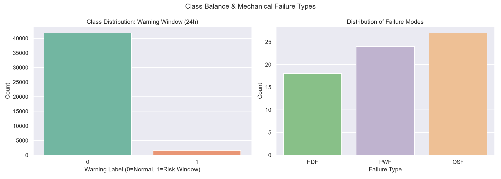
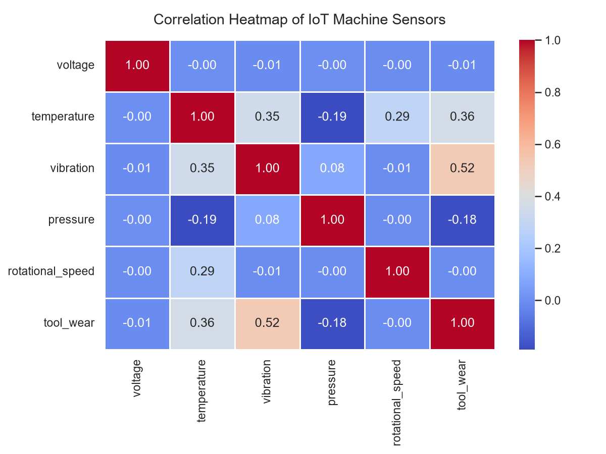
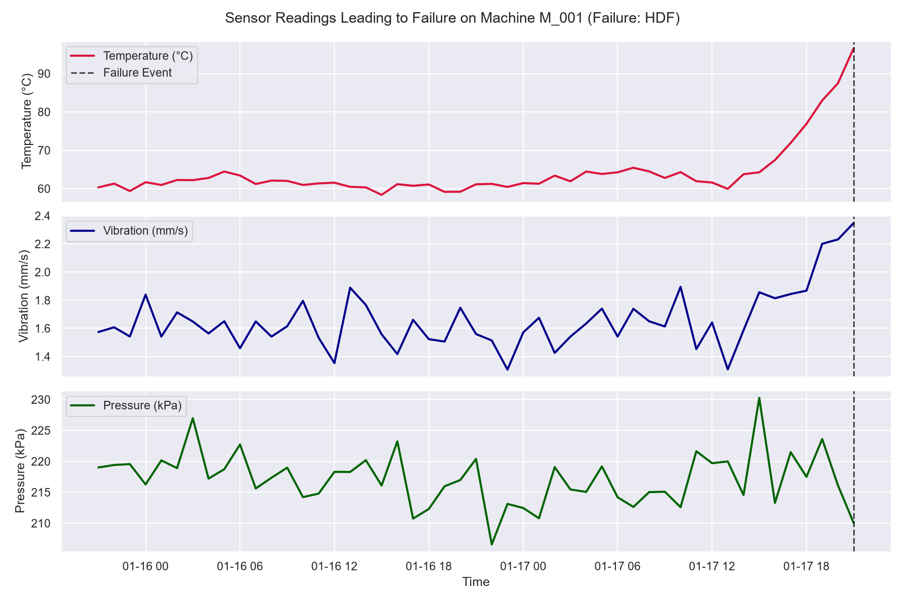

# Exploratory Data Analysis (EDA) Report

This document reports the structural and statistical characteristics of the predictive maintenance dataset.

---

## 1. Dataset Dimensions & Completeness

* **Total Operational Records**: 43524 hours of active machine telemetry.
* **Exact Failures Logged**: 69 breakdowns.
* **Risk Window Records (Target Class = 1)**: 1656 hours (3.80% of total data).
* **Missing Values**:
| Column | Missing Count |
| --- | --- |
| timestamp | 0 |
| machine_id | 0 |
| voltage | 0 |
| temperature | 0 |
| vibration | 0 |
| pressure | 0 |
| rotational_speed | 0 |
| tool_wear | 0 |
| failure_type | 0 |
| failed_now | 0 |
| failure_within_window | 0 |

---

## 2. Sensor Summary Statistics

The table below outlines the ranges, averages, and variability of the IoT sensors during operation:

| Metric | voltage | temperature | vibration | pressure | rotational_speed | tool_wear |
| --- | --- | --- | --- | --- | --- | --- |
| **count** | 43524.000 | 43524.000 | 43524.000 | 43524.000 | 43524.000 | 43524.000 |
| **mean** | 220.030 | 61.059 | 1.392 | 206.564 | 1499.874 | 5.100 |
| **std** | 5.112 | 4.077 | 0.213 | 8.268 | 43.263 | 3.866 |
| **min** | 172.787 | 50.237 | 0.594 | 176.755 | 1366.440 | 0.010 |
| **25%** | 216.625 | 58.255 | 1.246 | 200.495 | 1466.443 | 1.895 |
| **50%** | 220.027 | 60.522 | 1.388 | 206.213 | 1500.105 | 4.227 |
| **75%** | 223.410 | 63.386 | 1.537 | 212.326 | 1532.944 | 7.637 |
| **max** | 266.789 | 103.944 | 2.483 | 235.353 | 1653.383 | 18.812 |

---

## 3. Class Distribution & Imbalance Analysis

Predictive maintenance suffers from extreme class imbalance because machinery operates normally 95%+ of the time. Simple accuracy is a deceptive metric here. We visualize the distribution of normal vs. warning classes below:

---

## 4. Sensor Cross-Correlation Heatmap

Understanding sensor correlations tells us if multiple sensor systems are co-dependent or redundant.
- High correlation between **Temperature** and **Vibration** is common as component friction causes both heat and oscillation.
- Negative correlation with **Pressure** represents degradation of fluid boundaries over time.

---

## 5. Physical Sensor Degradation Patterns

This chart tracks a 48-hour period leading to a mechanical failure. Observe how the signals degrade (temperature rises, vibration escalates, and pressure drops) prior to the failure boundary:

